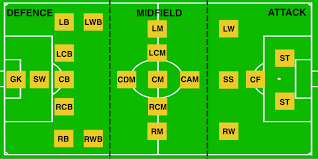
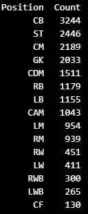
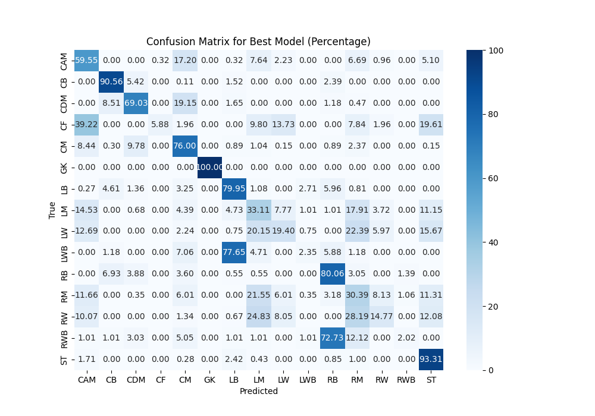

# ⚽ FIFA Player Position Classification

This repository contains an analysis of supervised learning algorithms for classifying player positions in the EA Sports FC 24 dataset. We compare the performance of Neural Networks, Support Vector Machines (SVM), and k-Nearest Neighbors (k-NN) on this multiclass classification problem, revealing insights into the capabilities and limitations of each model when dealing with an imbalanced dataset of player statistics.

---

## 📑 Table of Contents

1. [Introduction](#introduction)
2. [Dataset Overview](#-dataset-overview)
3. [Models and Algorithms](#-models-and-algorithms)
4. [Results](#-results)
5. [Installation and Setup](#-installation-and-setup)
6. [How to Run](#-how-to-run)
7. [Future Work](#-future-work)
8. [References](#-references)

---

## Introduction

This project aims to classify soccer players' positions based on their in-game statistics using three supervised learning algorithms: Neural Networks, Support Vector Machines (SVM), and k-Nearest Neighbors (k-NN). The classification task involves predicting the primary position of a player, such as goalkeeper, midfielder, or forward, based on attributes like physical stats, skills, and playing style.

---

## Dataset Overview

The dataset, obtained from Kaggle, includes player statistics from the EA Sports FC 24 video game. The dataset features 46 attributes for each player and covers 15 distinct positions. The positions are categorized into three groups: Defense, Midfield, and Attack, with specific roles like Goalkeeper (GK), Central Midfielder (CM), and Striker (ST).

  
*Figure 1: General field positions of soccer players.*

- **Positions with Higher Counts**: Central Back (CB), Striker (ST), and Central Midfielder (CM) are well-represented.
- **Positions with Lower Counts**: Central Forward (CF), Left Wing-Back (LWB), and Right Wing-Back (RWB) are less frequent.

---

## Models and Algorithms

The project employs three algorithms for the classification task:

1. **Neural Networks (NN)**: 
   - Architecture: Two hidden layers with 64 nodes each, using activation functions like ReLU and Tanh.
   - Optimizer: Adam, with different learning rates.
   - Cross-validation: 5-fold cross-validation with early stopping.

2. **Support Vector Machines (SVM)**:
   - Kernels: Linear and Radial Basis Function (RBF).
   - Regularization parameter (C): Values of 0.1, 1, and 10.

3. **k-Nearest Neighbors (k-NN)**:
   - Hyperparameter tuning: Number of neighbors (k) set to 5 and 10.
   - Distance metric: Euclidean.

---

## Results

The analysis showed varying success across models:
- **Neural Networks**: Achieved high accuracy on distinct positions like GK and CB but struggled with overlapping roles such as LWB and LB.
- **Support Vector Machines**: Outperformed NNs in some cases, especially for linear separable data, but showed overfitting tendencies.
- **k-Nearest Neighbors**: Lagged behind other models, with a tendency to misclassify similar positions due to the high dimensionality of the data.

  
*Figure 2: Number of players per position in the dataset.*

Refer to the detailed confusion matrices and accuracy graphs for more insights.

## Confusion Matrix

The confusion matrix below shows the classification performance of the best model, highlighting the accuracy for each position. The matrix illustrates which positions were correctly classified and where misclassifications occurred.

  
*Figure 3: Confusion matrix showing the classification accuracy for each player position.*

---


---

## Installation and Setup

To get started, clone the repository and set up the required dependencies.

### Prerequisites

Make sure you have the following installed:
- **Python 3.6+**
- Libraries: `numpy`, `pandas`, `scikit-learn`, `matplotlib`, `tensorflow` (for NNs), `seaborn`

### Installation

1. Clone the repository:
   ```bash
   git clone https://github.com/your_username/fifa-position-classification.git
